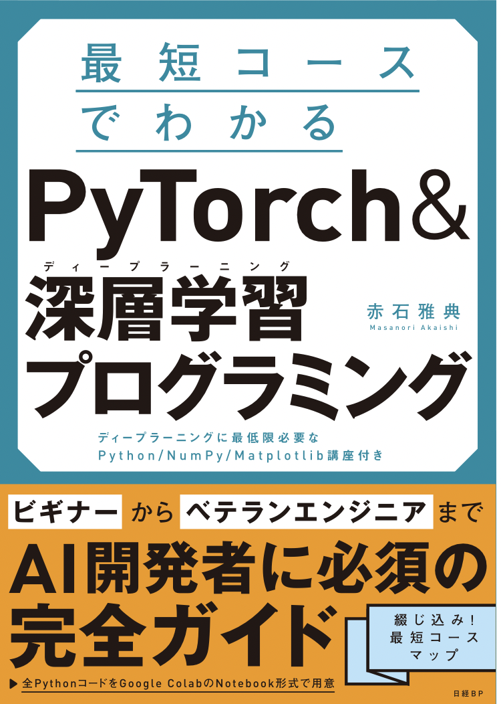
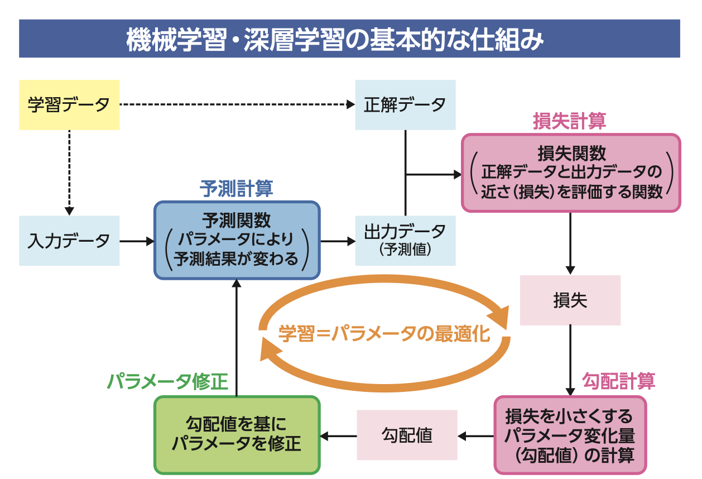
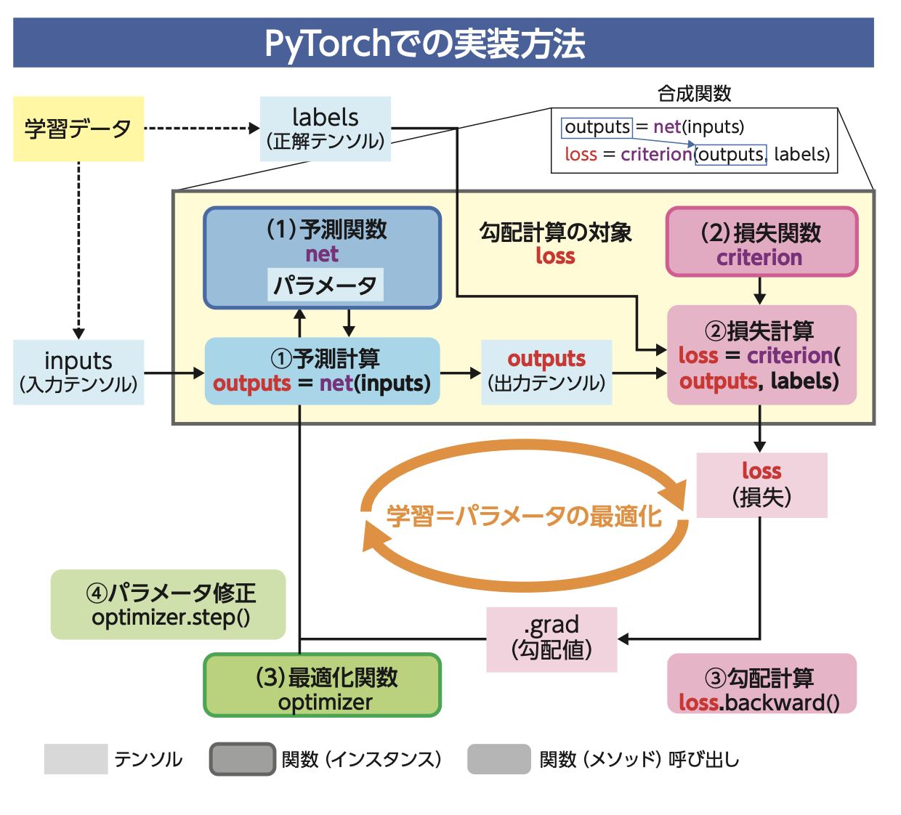
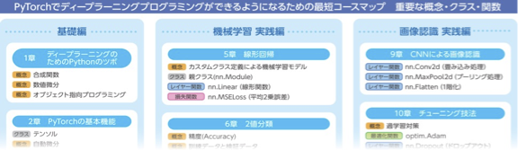

# 書籍「最短コースでわかる PyTorch &深層学習プログラミング」サポートサイト

　当サイトは、書籍「最短コースでわかる PyTorch &深層学習プログラミング」のサポートサイトです。  
　本書は、人気のAIフレームワーク「PyTorch」で、ディープラーニングプログラミングができるようになる本です。ディープラーニングのアルゴリズムが原理からわかります。初心者でも他書に頼らず、本書1冊でマスターできます！

## 実習Notebookリンク
　本書の実習コードは、Google Colabで動かすことを前提に、すべてGithub(当サポートサイト)で公開しています。  

[実習Notebook一覧](notebooks.md)

[実習Notebookの動かし方](refs/how-to-run.md)

## Amazonへのリンク
[単行本](https://www.amazon.co.jp/dp/4296110322) 
 
[Kindle](https://www.amazon.co.jp/dp/B09G622WB6/)  

　
## 本書の特徴

### 勾配降下法の動作原理とPyTorch実装を、イメージから理解
　ディープラーニングの学習原理である勾配降下法は、3章で山登りのたとえ話で数式なしに理解できるようになります。アルゴリズムとしての動作原理と、PyTorch実装については、下の2つの図で、より具体的なイメージが持てます。

**勾配降下法の動作原理**

  

**PyTorchによる勾配降下法実装**

### 重要概念を一歩一歩確実に理解
　PyTorchプログラミングにおいて重要な概念については、詰め込まず、一歩一歩確実に進めるようにしてあります。見開きのコースマップで、どこまで進んだかも一目でわかります。

**コースマップ**

### 合成関数も可視化ツールで理解
　機械学習・ディープラーニングにおける学習とは、「損失」と呼ばれる合成関数の最適化です。本書では、PyTorchが自動生成した合成関数（計算グラフ）を可視化するツールを活用して、この合成関数の様子をイメージから理解できるようにしています。

**計算グラフの可視化例**

## 主な想定読者
本書は、次のような読者を想定しています。

1. **企業でディープラーニングプログラムを業務で利用している、あるいはこれから利用しようとしているITエンジニアや研究者**  
　Keras/Tensorflowを使った経験がある方は、まずPyTorch独特の「ポリシー」につまずきがちです。PyTorchは「多値分類モデルにおける損失関数」の考え方が独特で、それを分かりやすく解説します。

2. **入門書を読んで機械学習やディープラーニングアルゴリズムの実装イメー ジは持てたが、この先どのように活用したらよいかがわからない方**  
　9 ~ 12 章の「画像認識 実践編」では、最終的に「転移学習」と呼ばれる少ない学習データで学習可能な方法を用いて、自分で集めた画像データを使って 分類モデルを作ります。12 章までたどり着けば、すぐに自分で集めた画像デー タを使って分類モデルが作れるようになります。
 また、8 章までの内容は PyTorch でのプログラミング方法を理解すると同時 に、これまで入門書で学んだ機械学習やディープラーニングのアルゴリズムを 復習することにもなります。

3. **理工系の大学・大学院の学生で研究の一環としてディープラーニングのプログラムを開発する必要がある方**  
　今後、論文で公開されている実装コードを試すには、PyTorchの知識が必須になってきます。本書では、ディープラーニングに必要な数学をイメージとして解説するので、公開コードを深く理解し、応用できるようになります。

4. **まだPythonもKeras/TensorFlowも知らないが、ディープラーニングプログラミングをこれから勉強してみたいという方**  
　初心者に向けて、PyTorchプログラミングを理解するのに必要な、Pythonの基本文法と、NumPy、Matplotlibの必要最小限の機能を、巻末の講座として用意しました。目的がディープラーニングだけなら、本書の講座で書いた概念・機能だけを理解すれば十分で、ディープラーニングを学ぶためのスタートラインに立てます。

　本書は、新しい概念は一気には詰め込まず、できるだけ細分化して一歩一歩確実に進めます。機械学習の基本から、「CNN」などを使った画像認識ディープラーニングモデルの開発・チューニングまでをじっくり学べます。

## 目次

* 序章    初めての画像認識

### 基礎編  
* 1章     ディープラーニングのためのPythonのツボ
* 2章     PyTorch入門
* 3章     初めての機械学習
* 4章     予測関数の定義

### 機械学習 実践編 
* 5章     線形回帰
* 6章     2値分類
* 7章     多値分類
* 8章     MNISTを使った数字認識

### 画像認識 実践編 
* 9章     CNNによる画像認識
* 10章    チューニング技法
* 11章    学習済みモデルの利用
* 12章    カスタムデータによる画像認識

### 講座　
* Python入門
* NumPy入門
* Matplotlib入門

## その他解説記事

* [ONNXファイルへのエクスポート方法](refs/onnx.md)  
11章のコラム「**汎用性のある事前学習済みモデルの作り方**」で言及している手順はこのリンク先にあります。

## リンク集

### 著者発信の情報

|ソース  |タイトルとリンク  |補足|
|---|---|---|
|speakerdeck|[最短コースでPyTorchとディープラーニングを征服するためのツボ](https://bit.ly/3nZHmdB)|2021年11月に行った学生向けイベントでのプレゼン資料。PyTorchと機械学習アルゴリズム理解のポイントをコンパクトにまとめています。|
|qiita|[書籍「最短コースでわかる PyTorch &深層学習プログラミング」補足情報と紹介](https://qiita.com/makaishi2/items/2c40fe43c01b35acb8c4)|書籍に書けなかった補足情報と書籍の特徴紹介です。|
|qiita|[書籍「Pytorch&深層学習プログラミング」２章補足　sum関数で微分計算ができる理由](https://qiita.com/makaishi2/items/a6cf19add4b6d16b8483)|2章ではPyTorchの自動微分機能を使って関数の微分計算をしています。p.82で1階テンソルをスカラー化するのにsum関数を使っていますが、紙面では「なぜsum関数を使うのか」の説明が不十分です。その部分を補うための記事となります。|
|qiita|[書籍「Pytorch&深層学習プログラミング」２章補足PART2　sum関数をmax関数に置き換えると何がおきるか？](https://qiita.com/makaishi2/items/2b39464dd7df89bf2c56)|上記記事の続編です。「sum関数の代わりにmax関数を使うと何がおきるか？それはなぜか」を解説しています。自動微分機能で何をやっているか深く理解するのに役立ちますので是非ご一読下さい。|
|qiita|[書籍「Pytorch&深層学習プログラミング」6章補足 決定境界表示プログラムの解説](https://qiita.com/makaishi2/items/290dd45af089bd866627)|6章の実習コードでは解説を一切抜きに、決定境界表示をしています。書籍で省略したその部分の解説記事です。|
|qiita|[書籍「最短コースでわかる PyTorch &深層学習プログラミング」3値分類モデルの決定境界の表示](https://qiita.com/makaishi2/items/3ff0b0a0496e115603bc)|7章の例題補足としての、３値分類問題の決定境界描画の実装と解説です。|
|qiita|[PyTorch 学習メモ (Karasと同じモデルを作ってみた)](https://qiita.com/makaishi2/items/3676d216fe9b34b63430)|本格的にPyTorchの勉強をはじめて約半日後にまとめた自分用のメモ。今回の本の原点とも言える記事です。今、読み直しても大筋間違ったことをいっていないのは自画自賛できるかも。|
|qiita|[PyTorchのDL ModelをWatson MLで動かす](https://qiita.com/makaishi2/items/3676d216fe9b34b63430)|PyTorchで作ったモデルをIBM Cloudにデプロイする手順です。上の[記事(ONNXファイルへのエクスポート方法)](refs/onnx.md)も参考にして下さい。|
|プレゼン資料|[AI・DS領域を学習したい方に向けて](https://speakerdeck.com/makaishi2/aidsling-yu-woxue-xi-sitaifang-nixiang-kete)|2022-12-03に異業種データサイエンス研究会主催で行われたイベントでの招講演資料です。本書を含め、それぞれの書籍執筆への「思い」を語っています。|
|twitter|[@makaishi2](https://twitter.com/makaishi2)|著者のツイッターアカウント。書籍に関連した情報発信とretweetが中心です。|
|IBM Blog|[AI関連書籍三冊目を出版したIBM赤石雅典に聞く「AIと仕事と執筆」](https://www.ibm.com/blogs/solutions/jp-ja/data_science_and_ai_akaishi-san/)|IBM勤務時代、会社のブログにインタビュー記事が紹介されています。|

### 外部リンク

|ソース  |タイトルとリンク  |補足|
|---|---|---|
|Amazon|[Amazonレビュー](https://www.amazon.co.jp/product-reviews/4296110322)||
|Honto|[Honto](https://honto.jp/netstore/pd-book_31207319.html)||
|読書メーター|[読書メーター](https://bookmeter.com/books/18544605)||
|BookLive|[BookLive](https://booklive.jp/product/index/title_id/1014297/vol_no/001)||
|レバテック　ブログ|[E資格の難易度や勉強方法、取得のメリットを徹底解説！](https://career.levtech.jp/guide/knowhow/article/697/)|E資格勉強法の解説の中で本書をご紹介いただいています。|
|からあげ様ブログ|[PyTorch入門書の決定版！「最短コースでわかる PyTorch ＆深層学習プログラミング」](https://karaage.hatenadiary.jp/entry/2021/09/24/073000)|AI関連で有名なブロガーである「からあげ」様による書評です。|

***

## 正誤訂正・FAQ

<!---
* [Notebook補足情報](notebook-ref.md)
-->  

* [正誤訂正](refs/errors.md)

* [FAQ](refs/faqs.md)

