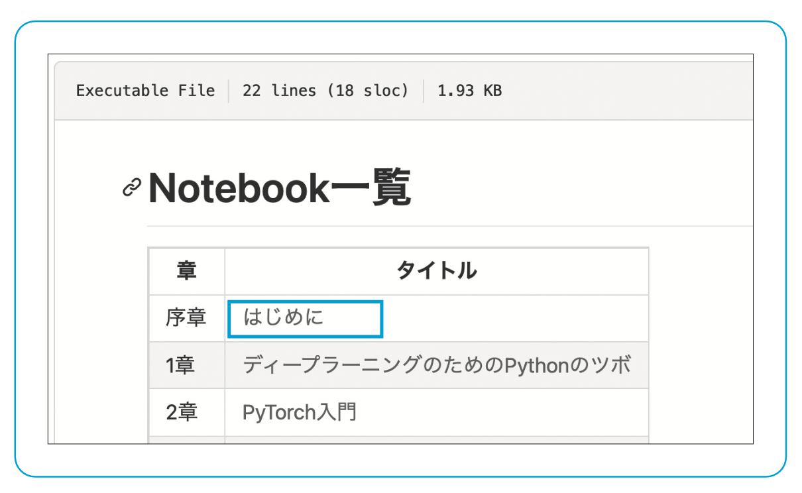
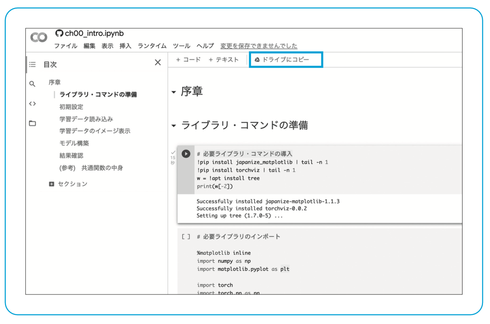
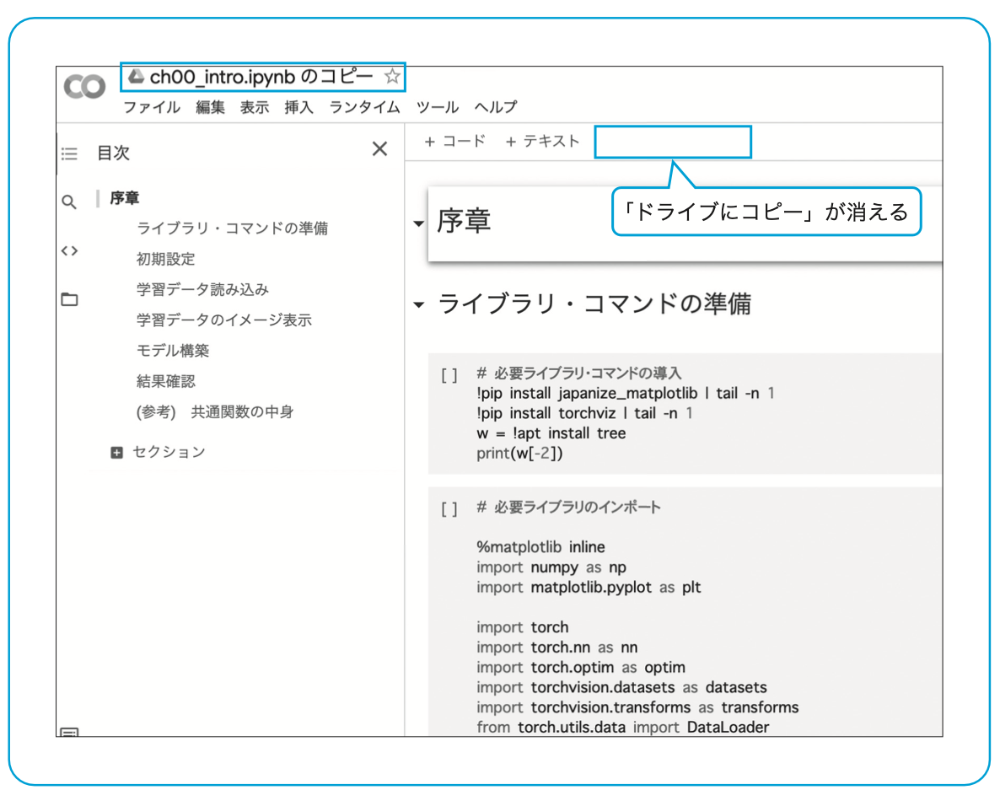
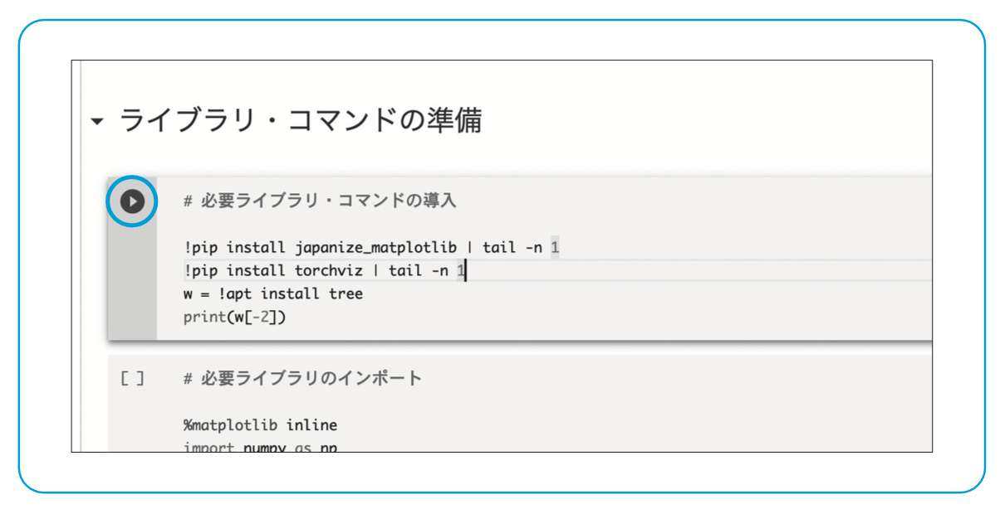
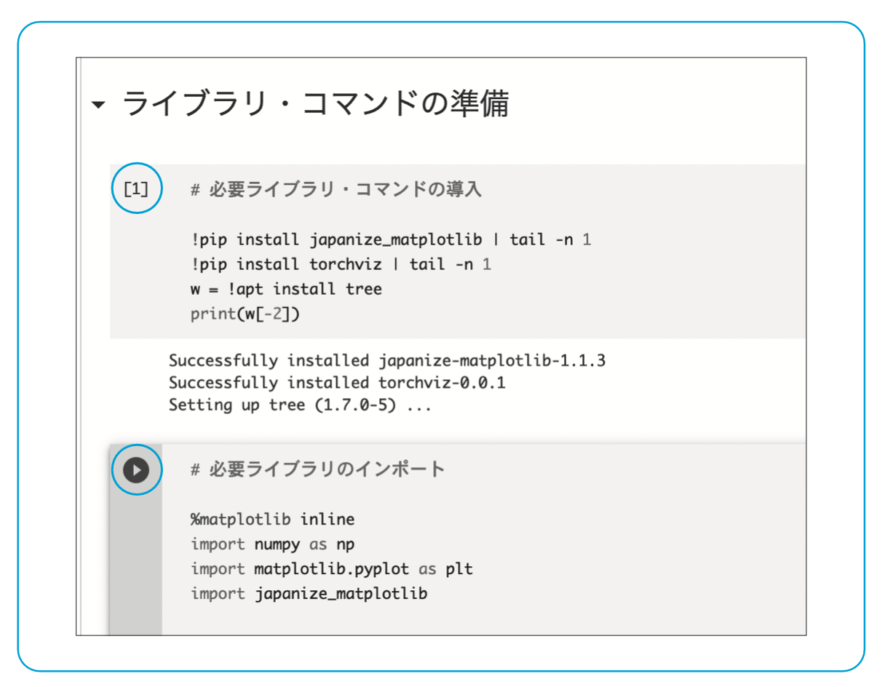

## 実習Notebookの動かし方

**前提**  
Gmailアドレスを事前に取得し、別タブでGmailにログインした状態にします。

1. 以下のリンクをクリックしてNotebook一覧を表示します。  
(コントロールキーを押しながらリンクをクリックすると別タブで開くことができます。)   
[Notebook一覧](../notebooks.md)
<!---
[Notebook一覧](../notebooks.md){:target="_blank" rel="noopener"} 

<a href="../notebooks.md" target="_blank">Notebook一覧</a>

-->  

2. 実行したいNotebookのリンクをクリックします。  
（以下では一番上の序章「はじめに」のリンクをクリックした場合の画面としています）

3. 青枠で囲んだ「ドライブにコピー」のリンクをクリックします。

4. 上の画面のようになれば、notebook 実行の準備は完了です。

　画面上部の「# 必要ライブラリ・ コマンドの導入」の下辺りをマウスでクリックしてください。上の図左の青丸で 囲んだような矢印アイコンが表示されます。  
　Notebook では「セル」と呼ばれる箱の単位でプログラムが実行されます。 矢印アイコンは、現在選択されている「セル」を意味します。  
　この状態で、「Shift + Enter」(Shift を押しながら Enter を押す)を入力すると、選択されたセルが 実行されます。プログラムの実行に多少時間がかかりますが、最終的に下図のようになるはずです。

　以下同様に、「Shift + Enter」を繰り返し実行して下さい。

[メインページに戻る](../README.md)
